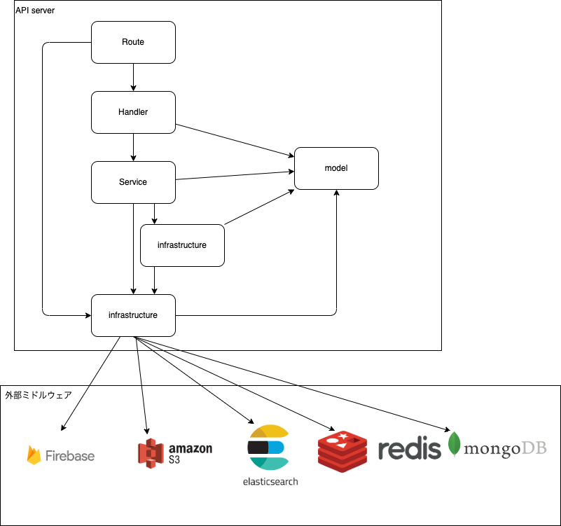

# 全体

ディレクトリ構成

```
.
├── cmd
│   └── main.go
│
│── app
│   ├── route
│   ├── controller
│   ├── service
│   ├── model
│   ├── util
│   ├── repository
│   └── infrastructure
│       ├─ mongodb
│       │   ├── schemas
│       │   └── mongo.go
│       ├─ mysql
│       │   ├── db.go
│       │   └── migrations
│       ├─ elasticsearch
│       │  └── elasticsearch.go
│       ├── redis
│       │   └── redis.go
│       ├── firebase
│       │   └── firebase_auth.go
│       └── aws
│           ├── s3
│           └── sqs
│── config
│   └── config.go
├── go.mod
└── go.sum

```

依存関係



## 共通規則

- 依存関係を飛ばしてデータにアクセスすることはできない

  - handler 層から infrastructure 層を呼び出すなど

- 各層のデータの受け渡しは model のデータを用いて受け渡しを行う

## Route

### 責務

- oas 生成した実装を controller 層にを紐づけを行う

## Controller

- router と 1 対 1 で紐付いている

### 責務

- service 層を呼び出し
- レスポンスのフォーマット
  - エラーハンドリング

## Service

- ビジネスロジックを記述
- Infrastructure 層の呼び出し

## Model

- オブジェクト指向プログラミングのオブジェクトを置いておくところ

## infrastructure

などの外部通信の処理を司る層

# このリポジトリで大切にしたいこと

- オレオレ過ぎないこと
- どこに何を書くべきかがわかりやすいこと
